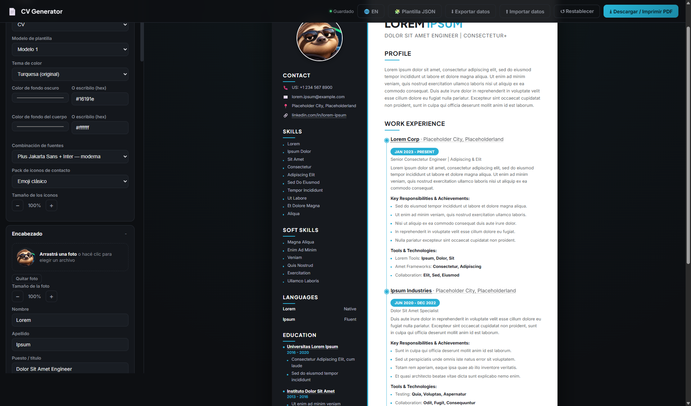
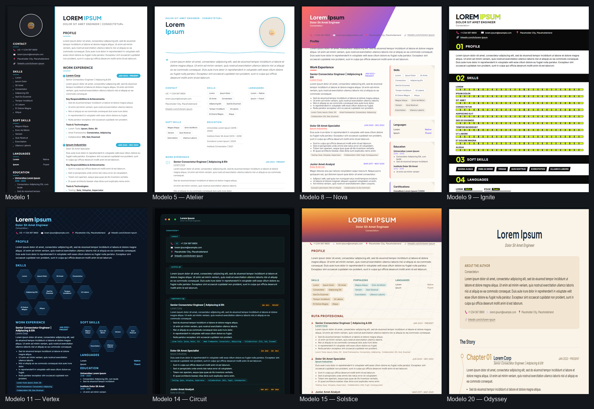

<p align="center"></p>

# 🦥 Lazy BYGS Update!

*(BYGS = Boys & Girls, obviously. 😂)*

**Too lazy to update your CV? Good. We automated that.**

Let's be honest. You changed jobs. Learned new technologies. Worked on interesting projects. Maybe even survived a few production incidents. And now you have to update your CV.

Open Canva. Find a template. Move some boxes around. Rewrite your experience. Adjust the formatting. Write a cover letter.

Ugh. Ain't nobody got time for that.

So: a simple, AI-friendly CV generator for people who want to get things done without overcomplicating their lives. It keeps **your** design — not a generic template — and makes it easy to add a new job, fix a date, or drop in a new skill without ever opening Canva again.



## 🎨 20 templates, 20 completely different designs

Not 20 recolors of the same layout — 20 actually different structures, each with its own persona and signature detail: a code-editor gutter for engineers, a scoreboard for gym coaches, a honeycomb of hexagons for data folks, a blueprint grid for architects, a chaptered "career as a story" layout, and more.



Pick one from the "Modelo de plantilla" dropdown — your data stays exactly the same, only the layout changes.

## 🚀 What it does (today)

- **20 templates, one editor.** Switch layouts freely — the form on the left never changes, so nothing you typed gets lost.
- **6 color themes + full custom colors + 30 font pairings + 10 contact-icon packs.** Or just leave the theme picker alone — every template ships with its own strong default look.
- **Bilingual output, one click.** A 🌐 EN/ES toggle flips every section title on the *printed CV* (Skills ↔ Habilidades, Work Experience ↔ Experiencia laboral, etc.) — independent from the editor, which stays in Spanish for editing convenience.
- **Live preview, always in sync.** Every field you edit updates the actual print layout instantly — what you see is exactly what lands in the PDF.
- **Add/remove anything.** Work experience, education, certifications, references, skills, languages, achievements — all repeatable, reorderable, no fixed number of entries.
- **Drag & drop (or click) to add your photo.** No image editor, no cropping tool — the preview handles the framing (circle, hexagon, blob, arch, and more, depending on the template).
- **Company names and LinkedIn become real links.** Drop in a URL and your company names / LinkedIn handle turn into clickable links in the printed CV.
- **Real backup, not just `localStorage`.** Export your data to a `.json` file and import it back later — so switching machines doesn't mean starting from scratch.
- **Print-ready PDF, no account, no watermark.** `Ctrl+P` → Save as PDF. Multi-page CVs paginate cleanly (sidebar included).
- **Runs completely offline.** No backend, no build step, no npm install, no subscription. It's HTML/CSS/JS — double-click `index.html` and go.
- **Autosaves locally.** Your data lives in your browser's `localStorage`. Nothing leaves your machine.

## 🤖 About the "AI-powered" part

There's no embedded AI API here — no key to configure, nothing to pay for. The AI part is **you, plus whatever AI assistant you already have** (ChatGPT, Claude, Claude Code, Cursor, whatever). The fastest path in:

1. Click **🧩 Plantilla JSON** in the app — downloads a blank `.json` with the exact shape the app expects (every field labeled with instructions, right inside the file).
2. Paste that file into your AI assistant of choice, along with your work history — a LinkedIn export, a messy bullet list, your old CV, whatever you've got — and ask it to fill in the template, keeping the same keys/structure.
3. Click **⬆ Importar datos** in the app and pick the file the AI gave you back. Your CV builds itself.
4. Open `index.html`, hit print, done.

(You can also just fill in the form on the left by hand — no AI required, same result.)

That's it. If we're already using AI to automate our work, why are we still updating our CVs by hand? No fancy promises, no magic button that guarantees you a job — just point a smart assistant at a well-organized template and let it do the typing.

## 🚧 Roadmap (not there yet)

- [ ] Cover letter generator (same drag-and-drop-easy philosophy)
- [ ] More templates (20 is not a ceiling)

Is it perfect? Nope. Does it need improvements? Absolutely. But that's the point — a simple tool built to save time and make life a little easier.

## 📦 Getting started

No install, no dependencies:

```bash
git clone https://github.com/<your-username>/lazybygsupdate.git
cd lazybygsupdate
# just open index.html in your browser — that's the whole setup
```

Then: fill in the editor on the left, watch the CV build itself on the right, hit **Descargar / Imprimir PDF** when it looks right.

## 🙋 Why

Spend less time messing around with your CV and more time doing literally anything else.

It's not perfect, it's not magic, and it's definitely not trying to replace a professional career coach. It's just a practical little project for people who want to spend less time formatting documents.

**Built for the lazy. Powered by AI. Ready for your next update.**

Because sometimes, you just want to update your CV and get on with your life. 😎

#LazyBYGS #OpenSource #AI #ClaudeAI #Automation #JobSearch #DeveloperTools
